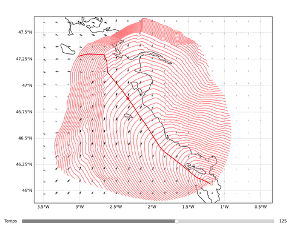

# Routage

## Description

Ce projet consiste en la création d'un algorithme de routage météorologique pour les voiliers. Étant donné des condition météorologiques (champs de vent, courant) et les performances d'un bateau (fonction polaire), l'objectif est de trouver la route de plus court temps entre un point départ et un point d'arrivée. L'algorithme developpé est basé sur la méthode des isochrones.

## Détail fichiers

vents.py : modèles de champs de vent V : x, y, t -> wind_dir, wind_speed

vents_grib.py : interpolations de prévisions de vent V : x, y, t -> wind_dir, wind_speed

polaires.py : polaires de vitesse de bateaux P : ang, wind_speed -> boat_speed

env_.py : calcul de l'enveloppe d'un nuage de points

isochrone_.py : mise en oeuvre de la méthode des isochrones, utilise un env_.py

exec_.ipynb : exection et affichage de l'ensemble

## Roadmap

[x] Réduction temps de calcul par passage numpy, KDTree
[x] Réduciotn temps de calcul par calcul partiel d'isochrones
[x] Interface avec barre de temps
[ ] Fonction rafineur de route
[ ] Intégration courants
[ ] Gestion de la côte / zones interdites
[ ] Corriger conversion def <-> nm
[ ] Intégration marrée, côté non fixe

